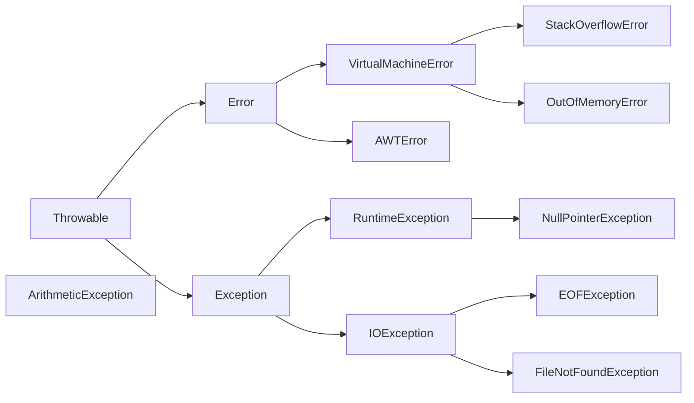

# `Programmazione 13/12/22`

<!--
# <p style="color:OrangeRed">title_big</p>
## <p style="color:SpringGreen">(new)title</p> --->

# <text style=color:red> Eccezioni e Asserzioni </text>
## Outline
+ Eccezioni, errori e asserzioni
+ Gerarchia
+ Gestione delle eccezioni
+ Eccezioni personalizzate
+ Asserzioni

### Eccezioni
Un'eccezione è una situazione imprevista che può verificarsi durante il flusso dell'esecuzione del programma. In Java si può gestire con le istruzioni `try` `catch` `finally` `throw` e `throws`

__Esempio__
_Accesso a un reference null_

### Errori
Un errore invece è una situazione imprevista e _non gestibile_.

___Esempio___

_Fine della memoria_

### Asserzioni
Una asserzione è una condizione che deve essere sempre verificata, e sono spesso usate in fase di sviluppo e disabilitate al rilascio. Sono utili per il debug.

___Esempio___

_Un divisore deve essere sempre diverso da zero.

## Gerarchia delle eccezioni
### Frammento della gerarchia delle eccezioni.


Le parole chiave per gestire le eccezioni sono:
+   `try`
+   `catch`
+   `finally`
+   `throw`
+   `throws`

Si mette il codice "pericoloso" in un _blocco_ _try_ seguito da blocchi _catch_.

_Esempio_
```java
public class Ecc1{
    public static void main(String args[]){
        int a = 10;
        int b = 0;
        int c = a/b;
        System.out.println(c);
    }
}
```

A runtime avremo:
```zsh
Exception in thread "main" java.lang.ArithmeticException: / by zero at Ecc1.main(Ecc1.java:6)
```
Questi log ci comunicano:
+   Tipo di eccezione: (java.lang.ArithmeticException)
+   Messaggio descrittivo: (/ by zero)
+   Metodo in cui è stata lanciata l'eccezione (at Ecc1.main)
+   File in cui è stata lanciata l'eccezione (Ecc1.java)
+   Riga in cui è stata lanciata l'eccezzione(:6)

### Uso di try / catch
```java
public class Ecc2 {
    public static void main(String args[]) {
        int a = 10;
        int b = 0;
        try {
            int c = a/b;
            System.out.println(c);
        }
        catch (ArithmeticException exc) {
            System.out.println("Divisione per zero...");
            exc.printStackTrace(); // Cosa fa?
        }
        System.out.println("Continua da qui...");
    }
}
```

### Gestire eccezioni del tipo corretto
```java
int a = 10;
int b = 0;
    try {
        int c = a/b;
        System.out.println(c);
    }
        catch (NullPointerException exc) {
        exc.printStackTrace();
}
```
Produce un'eccezione non gestita e il programma termina.

## Eccezioni e polimorfismo
I parametri dei blocchi _catch_ possono essere polimorfi. Il blocco gestisce eccezioni del tipo indicato e di tutte le sue sottoclassi.

_Esempio_

```java
int a = 10;
int b = 0; 
try {
    int c = a/b;
    System.out.println(c);
    }
    catch (Exception exc) { // Cattura qualsiasi
                                // eccezione.
        exc.printStackTrace();
    }
```

### Gestire diversi tipi di eccezioni
+ Un blocco _try_ può essere eseguito da più _catch_

```java

    . . .

    int a = 10;
    int b = 0; 
    try {
    int c = a/b;
    } 
    System.out.println(c);
    catch (ArithmeticException exc){
        System.out.println("Divisione per zero...");
    }
    catch (NullPointerException exc) {
        System.out.println("Reference nullo...");
    }
    catch (Exception exc) {
        exc.printStackTrace(;)
   } 
```

Nell'esempio precedente vengono gestite eccezioni specifiche, se ne viene lanciata una imprevista viene eseguita la catch generica.

## Catch multipli

In alcuni casi la gestione di eccezioni di tipo diverso è identica.

Si usa il simbolo `|`

```java
int a
int b
try {
    int c = a/b;
    System.out.println(c);
}
catch (ArithmeticException | NullPointerException exc) {
    System.out.println(exc.getMessage()); 
}
catch (Exception exc) { 
    exc.printStackTrace();
}
```

## Istruzione _finally_

Oltre ai blocchi catch si pul definire un blocco _finally_.
Il blocco _finally_ viene esguito in ogni caso alla fine del try, anche se non viene lanciata nessuna eccezione.
```java
public class Ecc4 {
    public static void main(String args[]) {
        int a = 10;
        int b = 0;
        try {
            int c = a/b;
            System.out.println(c);
        }
        catch (ArithmeticException exc) {
            System.out.println("Divisione per zero...");
        }
        catch (Exception exc) {
            exc.printStackTrace();
        }
        finally {
            System.out.println("Operazione terminata");
        } 
    }
} 
```

