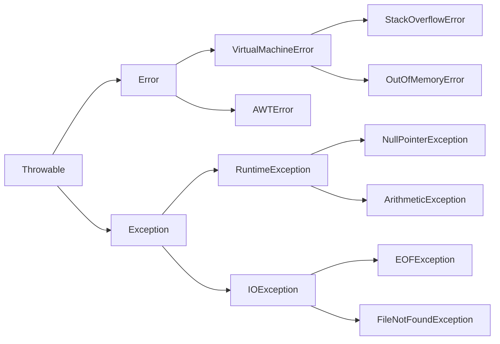

# `Programmazione 13/12/22`

<!--
# <p style="color:OrangeRed">title_big</p>
## <p style="color:SpringGreen">(new)title</p> --->

# <text style=color:red> Eccezioni e Asserzioni </text>
## Outline
+ Eccezioni, errori e asserzioni
+ Gerarchia
+ Gestione delle eccezioni
+ Eccezioni personalizzate
+ Asserzioni

### Eccezioni
Un'eccezione è una situazione imprevista che può verificarsi durante il flusso dell'esecuzione del programma. In Java si può gestire con le istruzioni `try` `catch` `finally` `throw` e `throws`

__Esempio__
_Accesso a un reference null_

### Errori
Un errore invece è una situazione imprevista e _non gestibile_.

___Esempio___

_Fine della memoria_

### Asserzioni
Una asserzione è una condizione che deve essere sempre verificata, e sono spesso usate in fase di sviluppo e disabilitate al rilascio. Sono utili per il debug.

___Esempio___

_Un divisore deve essere sempre diverso da zero.

## Gerarchia delle eccezioni
### Frammento della gerarchia delle eccezioni


Le parole chiave per gestire le eccezioni sono:
+   `try`
+   `catch`
+   `finally`
+   `throw`
+   `throws`

Si mette il codice "pericoloso" in un _blocco_ _try_ seguito da blocchi _catch_.

_Esempio_
```java
public class Ecc1{
    public static void main(String args[]){
        int a = 10;
        int b = 0;
        int c = a/b;
        System.out.println(c);
    }
}
```

A runtime avremo:
```zsh
Exception in thread "main" java.lang.ArithmeticException: / by zero at Ecc1.main(Ecc1.java:6)
```
Questi log ci comunicano:
+   Tipo di eccezione: (java.lang.ArithmeticException)
+   Messaggio descrittivo: (/ by zero)
+   Metodo in cui è stata lanciata l'eccezione (at Ecc1.main)
+   File in cui è stata lanciata l'eccezione (Ecc1.java)
+   Riga in cui è stata lanciata l'eccezzione(:6)

### Uso di try / catch
```java
public class Ecc2 {
    public static void main(String args[]) {
        int a = 10;
        int b = 0;
        try {
            int c = a/b;
            System.out.println(c);
        }
        catch (ArithmeticException exc) {
            System.out.println("Divisione per zero...");
            exc.printStackTrace(); // Cosa fa?
        }
        System.out.println("Continua da qui...");
    }
}
```

### Gestire eccezioni del tipo corretto
```java
int a = 10;
int b = 0;
    try {
        int c = a/b;
        System.out.println(c);
    }
        catch (NullPointerException exc) {
        exc.printStackTrace();
}
```
Produce un'eccezione non gestita e il programma termina.

## Eccezioni e polimorfismo
I parametri dei blocchi _catch_ possono essere polimorfi. Il blocco gestisce eccezioni del tipo indicato e di tutte le sue sottoclassi.

_Esempio_

```java
int a = 10;
int b = 0; 
try {
    int c = a/b;
    System.out.println(c);
    }
    catch (Exception exc) { // Cattura qualsiasi
                                // eccezione.
        exc.printStackTrace();
    }
```

### Gestire diversi tipi di eccezioni
+ Un blocco _try_ può essere eseguito da più _catch_

```java

    . . .

    int a = 10;
    int b = 0; 
    try {
    int c = a/b;
    } 
    System.out.println(c);
    catch (ArithmeticException exc){
        System.out.println("Divisione per zero...");
    }
    catch (NullPointerException exc) {
        System.out.println("Reference nullo...");
    }
    catch (Exception exc) {
        exc.printStackTrace(;)
   } 
```

Nell'esempio precedente vengono gestite eccezioni specifiche, se ne viene lanciata una imprevista viene eseguita la catch generica.

## Catch multipli

In alcuni casi la gestione di eccezioni di tipo diverso è identica.

Si usa il simbolo `|`

```java
int a
int b
try {
    int c = a/b;
    System.out.println(c);
}
catch (ArithmeticException | NullPointerException exc) {
    System.out.println(exc.getMessage()); 
}
catch (Exception exc) { 
    exc.printStackTrace();
}
```

## Istruzione _finally_

Oltre ai blocchi catch si pul definire un blocco _finally_.
Il blocco _finally_ viene esguito in ogni caso alla fine del try, anche se non viene lanciata nessuna eccezione.
```java
public class Ecc4 {
    public static void main(String args[]) {
        int a = 10;
        int b = 0;
        try {
            int c = a/b;
            System.out.println(c);
        }
        catch (ArithmeticException exc) {
            System.out.println("Divisione per zero...");
        }
        catch (Exception exc) {
            exc.printStackTrace();
        }
        finally {
            System.out.println("Operazione terminata");
        } 
    }
} 
```
## Try with resources
Dalla Java 7 si possono indicare come parametri di try gli oggetti che devono essere chiusi in ogni caso.

Questi oggetti devono implementare l'interfaccia _Closeable_ o _AutoCloseable_.

Il _try with resources_ è equivalente ad aggiungere un blocco finally che fa le chiusure, e all'interno vi possono essere blocchi _catch_ e _finally_ che verranno eseguiti dopo le chiusure degli oggetti.

_Esempio_
```java
. . .
try
(
    Connection conn = DriverManager.getConnection(url, username, password);
    Statement stmt = conn.createStatement();
    ResultSet rs = stmt.executeQuery("SELECT * FROM BOOK")
)
{
    while(rs.next()){
        System.out.println(rs.getString(1));
    }
}
catch(SQLException e){
    e.printStackTrace();
}
```
## Eccezioni personalizzate
Le eccezioni comuni sono definite nel package java.lang, come NullPointerException, ArrayIndexOutOfBoundsException, ClassCastException...

Altre eccezioni invece sono definite in altri package, come FileNotFoundException EOFException nel package java.io;
SQLException in java.sql; ConnectionException in java.net.

Dunque è possibile definire nuovi tipi di eccezione necessari ai nostri scopi, per esempio in un sistema di prenotazione biglietti, eccezione quando si prova a prenotare un posto non disponibile.

_Esempio_

+ Creiamo la nostra eccezione custom estendendo la classe __Exception__

```java
public class PrenotazioneException extends Exception{
    public PrentoazioneException(){
        // il costruttore di Exception chiamato
        // inizializza la variabile privata message
        super("Problema con la prenotazione");
    }
    public String toString(){
        return getMessage() + "posti esauriti!";
    } 
}
```

### Lanciare le eccezioni personalizzate
La JVM intrinsecamente sa quando lanciare le eccezioni predefinite. Come fare per forzare il lancio di un eccezione?

## Istruzione _throw_
+ Creo l'oggetto eccezione e lo lancio
```java
PrenotazioneException exc = new PrenotazioneException();
throw exc;
```
+ Il lancio deve essere sempre condizionato al verificarsi della condizione anomala
```java
if(postiDisponibili == 0){
    throw new PrenotazioneException();
}
```
In seguito l'eccezione viene gestita normalmente.

_Esempio_
```java
try{
    // controllo sulla disponibilita dei posit
    if(postiDisponibili == 0){
        // lancio dell'eccezione
        throw new PrenotazioneException();
    }
    // istruzione eseguita se non viene
    // lanciata l'eccezione
    postiDisponibili--;
}
catch (PrenotazioneException exc){
    System.out.println(exc.toString());
}
```
```java
public class Botteghino{
    private int postiDisponibili;
    public Botteghino(){
        postiDisponibili = 100;
    }
    public void prenota(){
        try {
            // controllo sulla disponibilita dei posti
            if (postiDisponibili == 0) {
                // lancio eccezione
                throw new PrenotazioneException();
            }
            // metodo che realizza la prenotazione
            // se non viene lanciata l'eccezione
        }
        catch (PrenotazioneException exc) {
            System.out.println(exc.toString());
        }
    }
}
```
```java
public class GestorePrenotazioni {
    public static void main(String[] args){
        Botteghino botteghino = new Botteghino();
        for (int i = 1; i <= 101; ++i) {
            botteghino.prenota();
            System.out.println("Pren. posto n" + i);
        }
    }
}
```
_output_
```
Prenotato posto n1
...
Prenotato posto n100
Problema con la prenotazione: posti esauriti!
Prenotato posto n101
```

Qui si capisce subito che è meglio gestire l'eccezione fuori da dove si presenta: meglio gestirla in GestorePrenotazioni:
```java
public class GestorePrenotazioni {
    public static void main(String[] args) {
        Botteghino botteghino = new Botteghino();
        try {
            for (int i = 1; i <= 101; ++i) {
                botteghino.prenota();
                System.out.println("Pren. posto n" + i);
            }
        }
        catch (PrenotazioneException exc) {
            System.out.println(exc.toString());
        }
    }
}
```
```java
public void prenota() throws PrenotazioneException {
    // controllo sulla disponibilita dei posti
    if (postiDisponibili == 0) {
        throw new PrenotazioneException();
    }
    // metodo che realizza la prenotazione
    // se non viene lanciata l'eccezione
    postiDisponibili--;
}
```
_Output_
```
Prenotato posto n1
. . .
Prenotato posto n100
Problema con la prenotazione: posti esauriti!
```

## _throw_ e _throws_
`throw` : lancia un'eccezione
`throws` : avvisa il compilatore che il metodo lancia eccezioni che verranno gestite all'esterno

Senza la clausola _throws_ il compilatore darebbe in output:
```
Botteghino.java:5: unreported exception PrenotazioneException: must be caught or declared to be thrown.
```
Se un metodo chiama un metodo che ha una throws deve gestire l'eccezione o dichiarare una throws a sua volta.
Molti metodi della libreria standard di Java hanno una _throws_ che quindi va gestita.

Nella clausola _throws_ è possibile indicare più di una eccezione separandole con virgola:
```java
public void prenota() throws PrenotazioneException, NullPointerException {
. . .
}
```

## Eccezioni checked e unchecked
Bisogna specificare che il metodo può lanciare una PrenotazioneException.
+ Perché in altri casi non abbiamo specificato che può lanciare una IndexOutOfBoundsException o NullPointerException?

| Tipi| JVM
| - | -
|checked | Il compilatore controlla che le ecezioni siano gestite da qualcuno
|unchecked | Il compilatore non fa nessun controllo

Le unchecked sono `Error` e `RunTimeException` con tutte le loro sottoclassi.
Le checked sono tutte le latre sottoclassi di `Throwable`

## throws e override
Nelle funzioni ridefinite non è possibile dichiarare throws di eccezioni non definite nel metodo base, ma è invece possibile dichiarare throws di eccezioni che appartengono a sottoclassi di quelle del metodo base, quindi è una sorta di polimorfismo che vale per le eccezioni.

```java
public class ClasseBase {
    public void metodo() throws java.io.IOException {}
}
class SottoClasseCorretta1 extends ClasseBase {
    public void metodo() throws java.io.IOEXception {}
}
class SottoClasseCorretta2 extends ClasseBase {
    public void metodo() throws java.io.FileNotFoundException {}
}
class SottoClasseCorretta3 extends ClasseBase {
    public void metodo() {}
}
class SottoClasseScorretta extends ClasseBase {
    public void metodo() throws java.sql.SQLException {}
    // errore, solo sottoclassi di IOException valide per override
}
```
## Warnings
I warnings non sono errori, la classe viene compilata e il bytecode viene generato. Ma il compilatore segnala degli avvertimenti quando viene rilevata una situazione potenzialmente pericolosa per il flusso del programma. In alcuni casi il significato è ovvio in altri non ancora.

Nella classe PrenotazioneException vista prima avremo:
```
D:\java8\Codice\modulo_08\esempi\PrenotazioneException.java:1:warning: [serial] serializable class PrenotazioneException has no definition of serialVersionUID
public class PrenotazioneException extends Exception {
^
1 warning
```
### serialVersionUID
Throwable implementa l'interfaccia Serializable (package java.io), che consente agli oggetti che la implementano di essere serializzati per essere salvati su file o trasmessi.

Per operare in sicurezza in ambienti distribuiti ogni classe Serializable deve avere una serialVersionUID.

+ Deve essere static e final ma di solito anche private
```java
private static final long serialVersionUID = 5159120164L;
```
E' compito del programmatore accertarsi che il serialVersionUID sia univoco, ma è anche vero che alcuni IDE permettono di generarlo automaticamente.

### Sopprimere i warnings
+ Si possono sopprimere i warnings con l'annotazione:
```java
@SuppressWarnings("serial")
public class PrenotazioneException extends Exception { . . . }
```
Possiamo anche indicare a javac dalla riga di comando di ignorare tutti i warnings o i warnings di un certo tipo:
```
javac -Xlint:all PrenotazioneException.java
javac -Xlint:serial PrenotazioneException.java
```

## Assertions
Le asserzioni sono state introdotte in Java 1.4 con la parola chiave `assert`.

La assert permette di testare eventuali comportamenti previsti dal programmatore ed è un utile strumento per il debugging.

```java
assert boolean;
assert boolean: String;
```
Viene valutata l'espressione booleana, e in caso di falso il programma lancia l'errore AssertionError

```java
assert b > 0;
```
```java
if (! (b > 0)) {
    throw new AssertionError();
}
```
Possiamo indicare anche il messaggio che viene visualizzato:
```java
assert b > 0: "il valore di b è " + b;
```