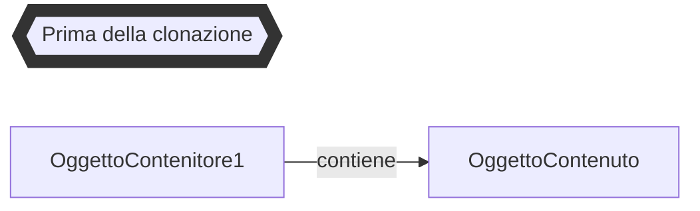
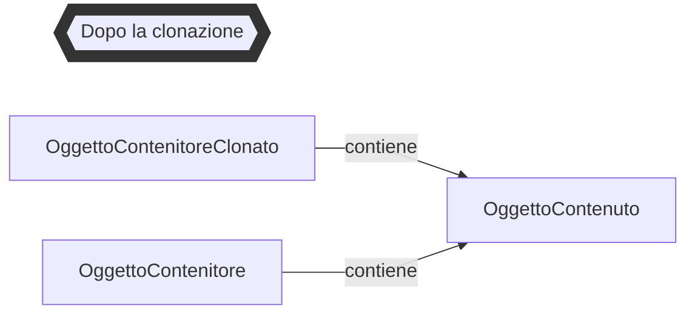

# `Programmazione 20/12/22`

# <text style=color:red>Libreria standard
## Outline
+ Classi fondamentali del package java.lang
  + String
  + Object
  + Math
+ Classi Wrapper
  + autoboxing-autounboxing
+ Ordinamento
  + Comparable e Comparator

## String
String e' l'unica classe che puo' essere istanziata come un tipo primitivo, e viene gestita con pool di stringhe, implementa la classe CharSequence.

Possiamo passare una String a tutti i metodi che richiedono una CharSequence.

Inoltre implementa Comparable(compareTo()) e Serializable.

### Metodi principali
| tipo          | nome              | parametri | funzionamento |
| :-            | :-                | :- | :- 
|__char__       | _charAt_          | <text style=color:turquoise> int index| restuisce il carattere all’indice index.
|__String__     | _concat_          | <text style=color:turquoise> String other| restituisce una nuova stringa che concatena la vecchia con other.
|__int__        |_compareTo_        | <text style=color:turquoise> String other| esegue una comparazione lessicale: int < 0 se la stringa corrente è minore di other, 0 se sono identiche e int > 0 se la stringa corrente è maggiore di other.
|__boolean__    |_endsWith_         | <text style=color:turquoise> String suffix| restituisce true se la stringa corrente termina con suffix.
|__boolean__    |_equals_           | <text style=color:turquoise> Object ob| restituisce true se il contenuto della stringa è uguale a quello di ob.
|__boolean__    |_equalsIgnoreCase_ | <text style=color:turquoise> String s| equivalente ad equals(), ma ignora la differenza tra maiuscole e minuscole. 
|__int__        |_indexOf_          | <text style=color:turquoise> int ch| restituisce l'indice del carattere ch. Restituisce -1 nel caso non venga trovato il carattere richiesto. 
|__int__        |_indexOf_          | <text style=color:turquoise> int ch, int fromIndex| è equivalente al metodo precedente ma considera a partire da fromIndex in poi. 

### Metodo statico _join_
```java
static String join(CharSequence delimiter, CharSequence... elements)
```
il metodo join ritorna una nuova stringa composta dai varargs (o la stringa "null" se uno dei varargs è null) separati da delimiter.
```java
String message = String.join("\\", "C:", "Esempi", "Java");
System.out.println(message);
// stampa "C:\Esempi\Java"
```
_Variante_
```java
static String join(CharSequence delimiter, Iterable<? extends CharSequence> elements)
```
E' una variante che usa in Iterable di CharSequence al posto del varargs.

### Altri metodi
| tipo          | nome              | parametri | funzionamento |
| :-            | :-                | :- | :- 
|__int__       | _lastIndexOf_          | <text style=color:turquoise> int ch| restituisce l'indice dell'ultima occorrenza di ch.
|__int__     | _length_          | | restituisce la lunghezza della stringa.
|__String__        |_replace_        | <text style=color:turquoise> char oldChar, char newChar| restituisce una nuova stringa con gli oldChar rimpiazzati da newChar.
|__String__    |_replace_         | <text style=color:turquoise> CharSequence target, CharSequence replacement| restituisce una stringa con le sottosequenze target rimpiazzate dalle sequenze replacement.
|__boolean__    |_startsWith_           | <text style=color:turquoise> String prefix| restituisce true se la stringa inizia con prefix.
|__boolean__    |_startsWith_ | <text style=color:turquoise> String prefix, int fromIndex| restituisce true se la sottosequenza a partire da fromIndex inizia con prefix. 
|__String[]__        |_split_          | <text style=color:turquoise> String regex| divide la stringa in un array di stringhe usando la regex come separatore.
|__String__       | _substring_          | <text style=color:turquoise> int startIndex| restituisce una sottostringa composta dai caratteri da startIndex alla fine.
|__String__     | _substring_          | <text style=color:turquoise> int startIndex, int endIndex| 
|__String__        |_toLowerCase_        | | 
|__String__    |_toUpperCase_         | | 
|__String__    |_toString_           | | ereditato dalla classe object.
|__String__    |_trim_ | | restituisce una nuova stringa privata dei caratteri spazio, newline e \r, se questi si trovano all'inizio o alla fine della stringa corrente.
|__static String__        |_valueOf_          | <text style=color:turquoise> Object obj| ritorna il valore di toString() o null se obj è null.

## Object
Object è la superclasse di tutte le classi, tutti i suoi metodi sono ereditati automaticamente da tutte le classi.
### Metodi principali
+ toString()
+ equals()
+ hashCode()
+ clone()
+ getClass()
+ ...
#### String toString()
Il toString() di Object restituisce una String che prevede il seguente formato:
```
NomeClasse@ValoreEsadecimale
```
Per i tipi wrapper restituisce il valore corretto.
#### boolean equals(Object obj)
La versione base di equals restituisce true se i due reference sono uguali, ed è equivalente all'operatore ==.

Nelle nostre classi sarebbe opportuno ridefinirlo per confrontare il contenuto degli oggetti e non gli indirizzi. In alcuni casi, come in String, è ridefinito in questo modo.
```java
@Override
public boolean equals(Object altroOggetto) {
    if (altroOggeto == null) {
        return false;
    }
    if (altroOggetto instanceof Punto) {
        Punto altroPunto = (Punto) altroOggetto;
        return this.x == altroPunto.x && this.y == altroPunto.y;
    } else {
        return false;
    }
}
```

#### int hashCode()
L'hash code è un numero intero che rappresenta l'oggetto. Se due oggetti sono uguali devono avere lo stesso hashcode, definito opportunamente.
Il contrario non è necessariamente vero, se due oggetti sono diversi potrebbero avere lo stesso hashcode (collisioni di hashCode).

Sono usati in HashTable, HashMap, HashSet, ecc.

Un buon metodo di hash dovrebbe essere compromesso fra precisione e prestazioni (bassa probabilità di collisione e limitato costo computazionale).
__Esempi__
```java
public int hashCode() {
    return x + y;
}
```
```java
public int hashCode() {
    return x ^ y;
}
```
```java
public int hashCode() {
    return 31 * x + y;
}
```
```java
public int hashCode() {
    return 31 * Objects.hash(x, y);
}
```
#### clone()
clone è un metodo da ridefinire per duplicare oggetti, il metodo clone() di Object fa una copia superficiale.




Object clone()
E' un metodo protected di Object(non definito nell'interfaccia Cloneable), dobbiamo fare override e promozione a public se vogliamo implementare il metodo clone().
```java
public class CloneableClass implements CLoneable {
    private String campo;
    // Dichiarazione dei metodi set e get omessi
    @Override
    public CloneableClass clone() throws CloneNotSupportedException {
        // Crea la copia e la ritorna
        return (CloneableClass) super.clone(); // Copia superficiale
    }
}
```
Se non implementiamo Cloneable non possiamo invocare clone() di Object. (CloneNotSupportedException).

#### Math
Math è una classe di java.lang, ha costruttore privato e non si può instanziare, inoltre è final e non può essere estesa.

Presenta solo membri static: due costanti (epsilon e pigreco) e circa trenta metodi.
+ funzioni matematiche: ___abs(), tan(), log(), pow(), max(), min(), sin(), cos(), exp(), sqrt(), . . .___
+ funzioni di arrotondamento: ___ceil(), floor(), round()___
+ generatore di numeri random: ___random()___

### Classi Wrapper
Le classi wrapper sono classi contenitore di tipi primitivi, definite in java.lang:
+ Byte
+ Short
+ Integer
+ Long
+ Float
+ Double
+ Boolean
+ Character


Sono immutabili, e dunque non hanno metodi set.
Sono anche indispensabili per usare tipi primitivi dove è richiesto un oggetto. Ad eccezione di Boolean e Character sono tutte sottoclassi di Number.

Hanno metodi static che fanno il parsing di una stringa con formato opportuno:
```java
int i = Integer.parseInt("1");
```
Analogamente ci sono parseLong() nella classe Long, parseDouble() ecc...
Bisogna fare attenzione inoltre a NumberFormatException.

#### Autoboxing-Autounboxing
L'autoboxing e l'autounboxing permettono di usare tipi primitivi dove ci si aspetta il corrispondente wrapper e viceversa, venne introdotto in Java 5.

_Esempio boxing_: Aggiungere un float a un ArrayList
```java
ArrayList<Float> list = new ArrayList<>();
list.add(5.3F);
```
```java
// equivalente a
ArrayList<Float> list = new ArrayList<>();
list.add(Float.valueOf(5.3F));
```
_Esempio unboxing_: leggere un float da un ArrayList
```java
float primitiveFloat = v.get(0);
```

E' possibile eseguire operazioni aritmetiche miste:
```java
Integer i = Integer.valueOf(22);
int j = i++;
Integer k = (Integer.valueOf(10) + j);
int t = k + j + i;
int i = 1;
Integer integer = Integer.valueOf(2);
int somma = i + integer;

Integer i = 0;
Double d = 2.2;
char c = Character.valueOf('c');
```
Per poter fare autounboxing-unboxing deve esserci corrispondenza esatta fra tipo primitivo e wrapper:
```java
double d = 2; // ok
Double d = 2; // errore di compilazione
```
Bisogna anche fare attenzione ai null 
```java
Boolean b = null;
boolean bb = b; // NullPointerException
```

### Pooling
Alcuni dati primitivi sono inscatolati nelle stesse istanze wrapper immutabili:
+ Byte
+ Short e Integer con valori fra -128 e 127
+ Character con valori da \u0000 a \u007F (da 0 a 127)
+ Boolean

Effetti da considerare su operatore == che fra tipi wrapper confronta l'indirizzo del reference: Una buona regola d'uso generale è quella di usare == solo per i tipi primitivi e metodo equals() per oggetti, wrapper inclusi.

__Esempio operatore ==__
```java
public class Comparison {
    public static void main(String[] args) {
        Integer a = 1000;
        Integer b = 1000;
        System.out.println(a == b); // FALSE

        Integer c = 100;
        Integer d = 100;
        System.out.println(c == d); // TRUE

        int e = 1000;
        Integer f = 1000;
        System.out.println(e == f); // TRUE

        int g = 100;
        Integer h = 100;
        System.out.println(g == h); // TRUE
    }
}
```
__Esempio con Collection__
_Senza autoboxing-autounboxing_
```java
ArrayList<Object> list = new ArrayList<>();
// write
list.add(Integer.valueOf(1));
list.add(Boolean.valueOf(false));
list.add(Character.valueOf('c'));
// read
Integer i = (Integer) list.get(0);
Boolean b = (Boolean) list.get(1);
Character c = (Character) list.get(2);
int intero = i.intValue();
boolean booleano = b.booleanValue();
char carattere = c.charValue();
```
_Con autoboxing-autounboxing_
```java
ArrayList<Object> list = new ArrayList<>();
// write
list.add(1);
list.add(false);
list.add('c');
// read
int intero = (Integer) list.get(0);
boolean booleano = (Boolean) list.get(1);
char carattere = (Character) list.get(2);
```
## Interfaccia Comparable
L'interfaccia Comparable ha un unico metodo compareTo(), implementata anche in String e nelle classi wrapper, ed è basata sui generics.
```java
package java.lang;
public interface Comparable<T> {
    public int compareTo(T o);
}
```
_Esempio_
```java
public final class String implements Comparable<String> { . . . }
```
_compareTo()_
```java
x1.compareTo(x2);
```
Deve ritornare +1, 0 oppure -1 a seconde se x1 sia maggiore, uguale o minore di x2.

Deve fare un confronto fra i valori e non fra i reference:
```java
Integer int1 = 4;
Integer int2 = 5;
Integer int3 = 5;
System.out.println(int1.compareTo(int2)); // -1
System.out.println(int2.compareTo(int1)); // 1
System.out.println(int2.compareTo(int3)); // 0
```
La Comparable viene usata per l'ordinamento.
### Ordinamento
Il metodo sort() di java.util.Arrays (classe di utilita' per array) ordina un array di tipo primitivo in base all'ordinamento naturale e un array di oggetti in base al metodo compareTo()
```java
String[] nomi = {"Marcello", "Serena", "Antonio"};
System.out.println("Array non ordinato:");
stampaArray(nomi);
Arrays.sort(nomi);
System.out.println("\nArray ordinato:");
stampaArray(nomi);
```

## Interfaccia Comparator
L'interfaccia Comparator, usata da java.util.Collections (classe utility per collection), ha un metodo di confronto che riceve i due oggetti come argomento, basata sui generics.
```java
package java.util;
public interface Comparator<T> {
    int compare(T o1, T o2);
    // . . .
}
```
Si deve creare una classe che implementa Comparator per confrontare due oggetti.

_Esempio_
+ Classe che ordina stringhe alfabeticamente dopo averle invertite
```java
public class StringComparator implements Comparator<String> {
    public int compareTo(String s1, String s2) {
        StringBuilder sb1 = new StringBuilder(s1);
        StringBuilder sb2 = new StringBuilder(s2);
        s1 = sb1.reverse().toString();
        s2 = sb2.reverse().toString();
        return s1.compareTo(s2);
    }
}
```
```java
String[] nomi = {"Marcello", "Serena", "Antonio"};

ArrayList<String> nomiList = new ArrayList<String>(Arrays.asList(nomi));

System.out.println("Lista non ordinata:");
System.out.println(nomiList);

Collections.sort(nomiList, new StringComparator());
System.out.println("Lista ordinata al contrario:");
System.out.println(nomiList);