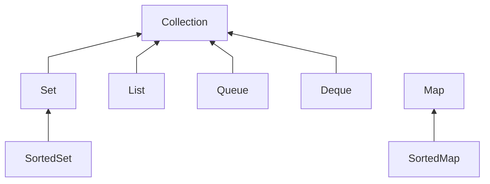

# `Programmazione 21/12/22`

# <text style=color:red>Collections
## Outline
+ Java Collections Framework
+ Interfaccia Collection
  + List
  + Set/SortedSet
  + Queue
  + Deque
+ Interfaccia Map
  + SortedMap
+ Metodi utility
  
## Java Collections Framework
La JCF è stata introdotta in Java 1.2, da Java 1.5 implementata la versione con i generics, è un framework che si occupa di gestire collezioni di oggetti.
_Vantaggi_
+ Possibilita' di scrivere meno codice
+ Maggiori performance
+ Riusabilita'
+ Algoritmi complessi gia implementati e disponibili
+ Maggiore qualita' e semplicita' del codice
E' basato su 8 interfacce principali e classi che le implementano, tutte le interfacce e le classi possono essere usate con Object e cast e problemi annessi o con generics.

### Proprietà fondamentali
+ Collection
  + Astrae il concetto di insieme di oggetti
+ List
  + Collezione ordinata. A ogni elemento è associato un indice. Ammette elementi duplicati.
+ Set
  + Collection che astrae il concetto di insieme matematico e quindi non ammette duplicati.
+ Queue
  + Astrae una coda. Prevede operazioni di nserimento, estrazione e ricerca.
+ Deque
  + Astrae una coda come Queue ma accessibile da entrambi i lati. Si può gestire come First-In-First-Out oppure come Last-In-First-Out.
+ Map
  + Struttura che associa chiavi ai suoi elementi. Non possono contenere chiavi duplicate ed ogni chiave può essere associata ad un solo valore.
## Interfaccia Collection
L'interfaccia Collection è la superinterfaccia del framework, possiamo usarla per puntare a qualsiasi implementazione di una sua qualsiasi sottointerfaccia:
```java
Collection<String> collection = new ArrayList<>();
```
Definisce i metodi di base, e ha il vantaggio di consentire l'accesso alla struttura dati tramite interfaccia: C'è quindi la possibilità di cambiare implementazione con effetti minimi sul codice scritto.
### Principali metodi di Collection
+   int size()
+   boolean add(E e)
+   boolean remove(Object element)
+   boolean isEmpty()
+   void clear()
+   boolean contains(Object element)
+   boolean containsAll(Collection<?> c)
+   Iterator<E> iterator()
#### Esempio Iterator
```java
Collection<String> progBands = new HashSet<>();
progBands.add("Dream Theater");
progBands.add("Ayreon");
progBands.add("Yes");
Iterator<String> iterator = progBands.iterator();
while (iterator.hasNext()) {
    System.out.println(iterator.next();)
}
```
```
Ayreon
Dream Theater
Yes
```
Nota che HashSet non mantiene l'ordine di inserimento.
#### Metodo containsAll
```java
boolean containsAll(Collection<?> c)
```
_Esempio_
```java
Collection<Integer> collection1 = new ArrayList<>();
for (int i = 0; i < 5; i++) {
    collection1.add(i);
}
Collection<Integer> collection2 = new ArrayList<>();
collection2.add(2);
collection2.add(1);
collection2.add(4);
System.out.println(collection1.containsAll(collection2));
// stampa true, collection2 contiene tutti gli oggetti di collection1
```
### Altri metodi
```java
boolean addAll(Collection<? extends E> c)
```
Aggiunge tutti gli elementi di c alla collezione per cui è chiamato il metodo.
### List
### Set
### SortedSet
### Queue
### Deque
## Interfaccia Map
### SortedMap
## Metodi utility