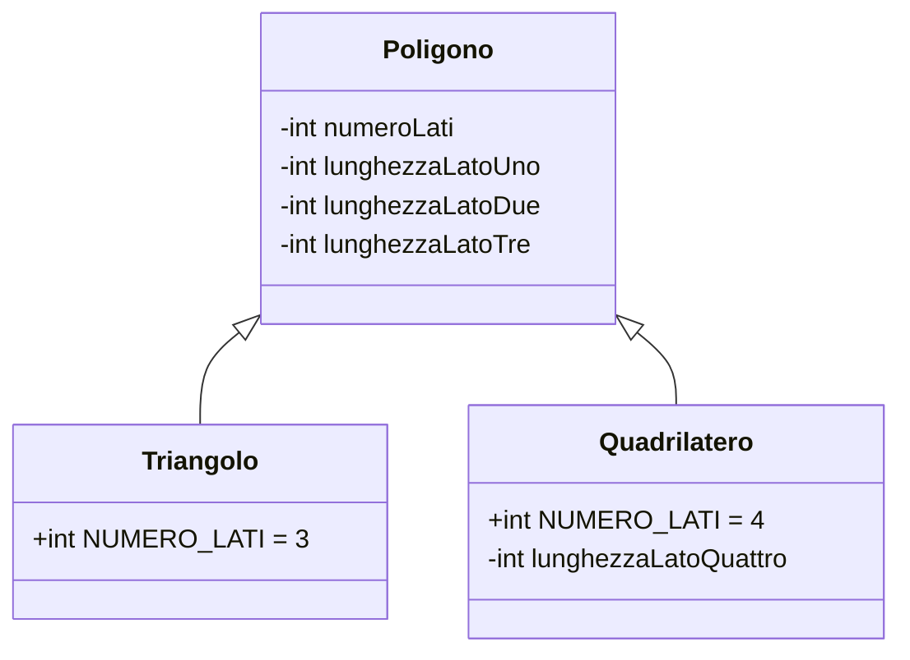
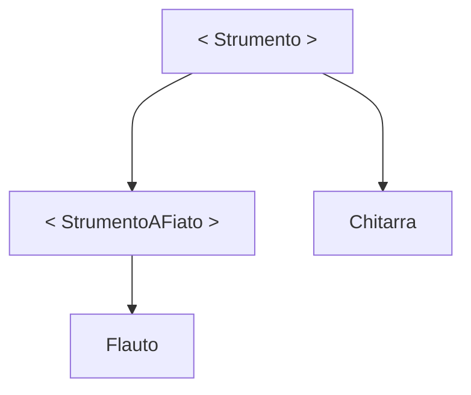
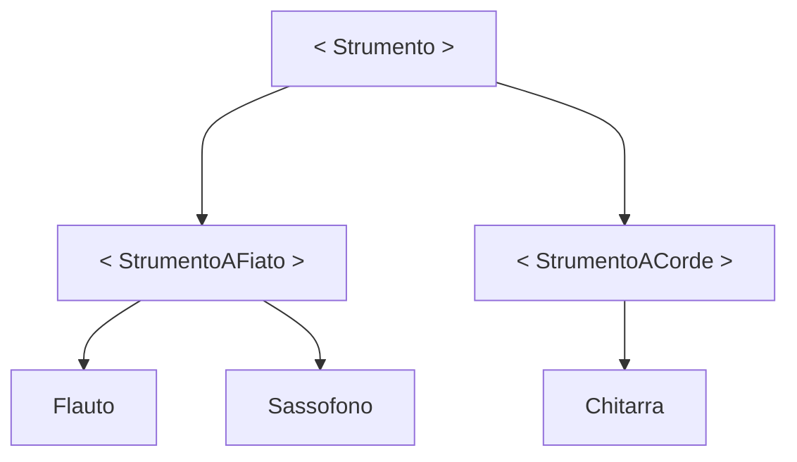

# `Programmazione 22/11/22`

<!--
# <p style="color:OrangeRed">title_big</p>
## <p style="color:SpringGreen">(new)title</p> --->

# <text style=color:red>Interfacce</text>
+   Generalizzazione e specializzazione
+   Modificatore abstract
+   Interfacce
+   Ereditarietà multipla

## Generalizzazione
La generalizzazione è un processo che porta all'implementazione dell'ereditarietà. A partire da un certo numero di classi, si definisce una sola superclasse che ne raccoglie le caratteristiche comuni

_Esempio_

```java
Triangolo is a Quadrilatero? false
Triangolo, Quadrilatero is a Poligoni? true
```
Allora generalizzo le due astrazioni in una classe comune <text style=color:turquoise>Poligono</text>.

```java
public class Poligono{
    private float lunghezzaLatoUno;
    private float lunghezzaLatoDue;
    private float lunghezzaLatoTre;
    .
    .
    .
}
```
```java
public class Triangolo extends Poligono{
    public final int NUMERO_LATI = 3;
    // . . .
}
```
```java
public class Quadrilatero extends Poligono{
    public final int NUMERO_LATI = 4;
    // . . .
}
```
### Notazione UML



## Specializzazione
La specializzazione è un processo che porta all'implementazione dell'ereditarietà.
A partire da una classe, si definiscono una o più sottoclassi allo scopo di ottenere oggetti più specializzati.

_Esempio 1_
```
Voglio creare una classe MioBottone che rappresenta un pulsante di un'interfaccia grafica.
Estendo la classe Button del package java.awt e devo solo aggiungere il codice che personalizzerà
il MioBottone.
```
_Esempio 2_
```
Ho la classe Poligono, e la specializzo per ottenere Triangolo, Quadrilatero, Pentagono, etc...
```

## Modificatore <text style=color:deepskyblue>abstract</text>
Il modificatore `abstract` si può applicare a __classi__ o a __metodi__:
+ `Metodi astratti`
  + Non implementano un blocco di codice ma terminano con `;`
    ```java
    public abstract void dipingiQuadro();
    ```
  +   Non potrà essere invocato (in quanto non è definito) ma potrà essere soggetto a __riscrittura di una sottoclasse__

+ `Classi astratte`
  + Non possono essere istanziate
  + Ha senso se inserita in un sistema in cui il corrispondente oggetto sarebbe troppo generico per essere istanziato

_Esempio_
```java
public abstract class Pittore{
    // . . .
    public abstract void dipingiQuadro();
    // . . .
}
```
Da questa classe si derivano le classi 
```java
public class PittoreImpressionista implements Pittore{. . .}
```
```java
public class PittoreNeoRealista implements Pittore{. . .}
```
Queste classi implementano ciascuna la propria versione (concreta e non astratta) di _dipingiQuadro()_

#### _Esempi_
+   ```java
    public abstract class Strumento{
        // Classe astratta
        public String nome;
        public String prezzo;
        public abstract void suonaFaDiesis();
            // Ogni strumento suona diversamente
        // . . .
    }
    ```
    ```java
    public class Chitarra extends Strumento{
        // Classe concreta
        public void suonaFaDiesis(){
            // Override (riscrittura) del metodo
            // Implementazione del metodo per la chitarra
        }
    // . . .
    }
    ```
+   ```java
    public abstract class StrumentoAFiato extends Strumento{
        // Classe di nuovo astratta che esstende Strumento
        // metodo suonaFaDiesis ereditato ancora astratto e
        // non riscritto perché troppo generico
        // . . .
    }
    ```
    ```java
    public class Flauto extends StrumentoAFiato{
        // Classe concreta che estende StrumentoAFiato
        public void suonaFaDiesis(){
            // Implementazione del metodo per il flauto
        }
        // . . .
    }
    ```

_Esempio Grafico_



+ Estendiamo la gerarchia:
StumentoACorde e Sassofono dove li mettiamo?



## Classi astratte
Le classi astratte sono uno strumento fondamentale per la progettazione, obbligano le sottoclassi a implementare un comportamento.

