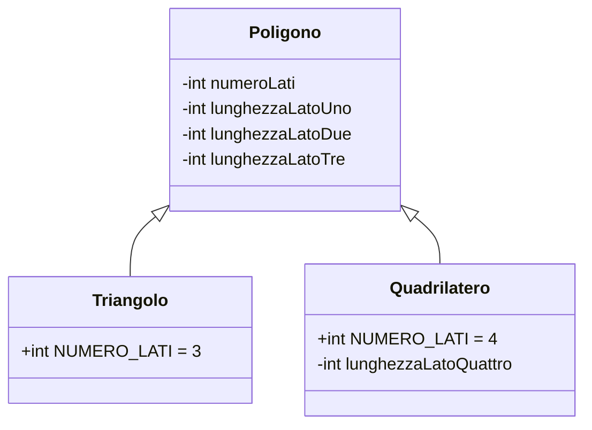
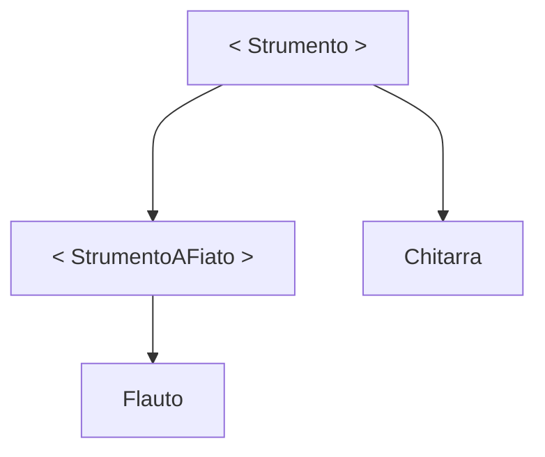
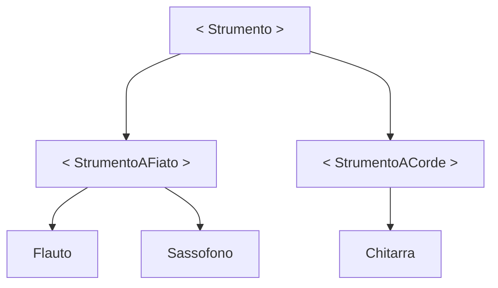
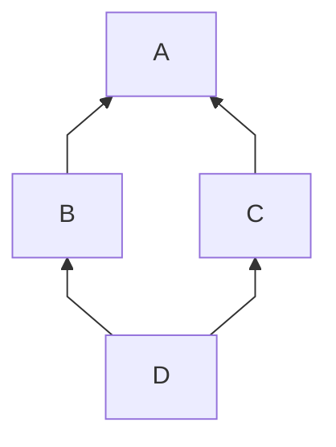
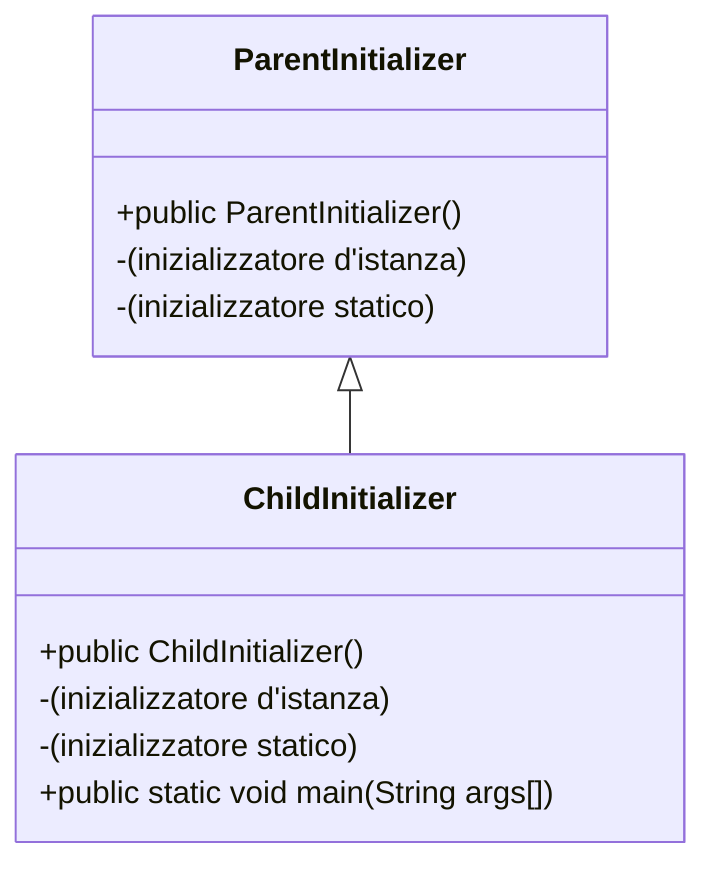

# `Programmazione 22/11/22`

<!--
# <p style="color:OrangeRed">title_big</p>
## <p style="color:SpringGreen">(new)title</p> --->

# <text style=color:red>Classi astratte e Interfacce</text>
+   Generalizzazione e specializzazione
+   Modificatore abstract
+   Interfacce
+   Ereditarietà multipla

## Generalizzazione
La generalizzazione è un processo che porta all'implementazione dell'ereditarietà. A partire da un certo numero di classi, si definisce una sola superclasse che ne raccoglie le caratteristiche comuni

_Esempio_

```java
Triangolo is a Quadrilatero? false
Triangolo, Quadrilatero is a Poligoni? true
```
Allora generalizzo le due astrazioni in una classe comune <text style=color:turquoise>Poligono</text>.

```java
public class Poligono{
    private float lunghezzaLatoUno;
    private float lunghezzaLatoDue;
    private float lunghezzaLatoTre;
    .
    .
    .
}
```
```java
public class Triangolo extends Poligono{
    public final int NUMERO_LATI = 3;
    // . . .
}
```
```java
public class Quadrilatero extends Poligono{
    public final int NUMERO_LATI = 4;
    // . . .
}
```
### Notazione UML



## Specializzazione
La specializzazione è un processo che porta all'implementazione dell'ereditarietà.
A partire da una classe, si definiscono una o più sottoclassi allo scopo di ottenere oggetti più specializzati.

_Esempio 1_
```
Voglio creare una classe MioBottone che rappresenta un pulsante di un'interfaccia grafica.
Estendo la classe Button del package java.awt e devo solo aggiungere il codice che personalizzerà
il MioBottone.
```
_Esempio 2_
```
Ho la classe Poligono, e la specializzo per ottenere Triangolo, Quadrilatero, Pentagono, etc...
```

## Modificatore <text style=color:deepskyblue>abstract</text>
Il modificatore `abstract` si può applicare a __classi__ o a __metodi__:
+ `Metodi astratti`
  + Non implementano un blocco di codice ma terminano con `;`
    ```java
    public abstract void dipingiQuadro();
    ```
  +   Non potrà essere invocato (in quanto non è definito) ma potrà essere soggetto a __riscrittura di una sottoclasse__

+ `Classi astratte`
  + Non possono essere istanziate
  + Ha senso se inserita in un sistema in cui il corrispondente oggetto sarebbe troppo generico per essere istanziato

_Esempio_
```java
public abstract class Pittore{
    // . . .
    public abstract void dipingiQuadro();
    // . . .
}
```
Da questa classe si derivano le classi 
```java
public class PittoreImpressionista implements Pittore{. . .}
```
```java
public class PittoreNeoRealista implements Pittore{. . .}
```
Queste classi implementano ciascuna la propria versione (concreta e non astratta) di _dipingiQuadro()_

#### _Esempi_
+   ```java
    public abstract class Strumento{
        // Classe astratta
        public String nome;
        public String prezzo;
        public abstract void suonaFaDiesis();
            // Ogni strumento suona diversamente
        // . . .
    }
    ```
    ```java
    public class Chitarra extends Strumento{
        // Classe concreta
        public void suonaFaDiesis(){
            // Override (riscrittura) del metodo
            // Implementazione del metodo per la chitarra
        }
    // . . .
    }
    ```
+   ```java
    public abstract class StrumentoAFiato extends Strumento{
        // Classe di nuovo astratta che esstende Strumento
        // metodo suonaFaDiesis ereditato ancora astratto e
        // non riscritto perché troppo generico
        // . . .
    }
    ```
    ```java
    public class Flauto extends StrumentoAFiato{
        // Classe concreta che estende StrumentoAFiato
        public void suonaFaDiesis(){
            // Implementazione del metodo per il flauto
        }
        // . . .
    }
    ```

_Esempio Grafico_



+ Estendiamo la gerarchia:
StumentoACorde e Sassofono dove li mettiamo?




## Classi astratte
Le classi astratte sono uno strumento fondamentale per la progettazione, obbligano le sottoclassi a implementare un comportamento.

Una classe <text style=color:turquoise>_abstract_</text> __deve__ essere estesa per poter essere istanziata.
Al contrario, una classe <text style=color:turquoise>_final_</text> __non può__ essere estesa.
Inoltre, un metodo non può essere _abstract_ e _final_ contemporaneamente

## Ereditarietà multipla
Nel mondo reale, un oggetto può appartenere a diverse _classi_ (ad esempio una persona può essere contemporaneamente programmatore, genitore e musicista).
Ma in Java, non esiste l'ereditarietà multipla, una classe può estendere una classe per volta, perciò dopo la clausola <text style=color:turquoise>_extends_</text> si può solamente specificare una e una sola classe.

```java
public class Persona extends Programmatore, Genitore, Musicista{
    // . . .
}
```

+ <text style=color:red>ERRORE DI COMPILAZIONE</text>

## Le Interfacce
Le interfacce sono un evoluzione del concetto di classe astratta sopracitato.
### Definizione (pre-Java 8)
Un'interfaccia può possedere solo metodi dichiarati implicitamente public e abstract, e variabili dichiarate implicitamente public, static e final.

Se usiamo modificatori diversi, ad esempio un metodo protected, il compilatore segnala un errore (`i metodi e le variabili di un'interfaccia devono essere tutti public`).

Se una classe eredita metodi da un'interfaccia, deve ridefinire i metodi astratti ereditati (a meno che non si voglia dichiarare astratta)

+   L'uso di un'interfaccia è limitato alla sua funzione di essere una specifica astratta per le classi che la implementano

Il compilatore inserisce automaticamente i modificatori assenti.
```java
public interface Saluto{
    String CIAO = "Ciao";
    String BUONGIORNO = "Buongiorno";
    // . . .
    void saluta();
}
```
```java
public interface Saluto{
    public static final String CIAO = "Ciao";
    public static final String BUONGIORNO = "Buongiorno";
    // . . .
    public abstract void saluta();
}
```

Le interfacce vanno scritte in file con lo stesso nome ed estensione `.java`, e non possono essere istanziate.
Per istanziare degli oggetti di quella interfaccia abbiamo bisogno di altre classi che __implementano__ le interfacce

### Parola chiave <text style=color:turquoise>_implements_</text>
+    Ha una sintassi simile a _extends_

Possiamo creare una classe che implementa più interfacce, ma solo un'interfaccia può estendere un'interfaccia, in questo modo si possono creare gerarchie di sole interfacce

#### In sintesi
Un'interfaccia può estendere un'altra interfaccia.
Una classe può implementare una o più interfacce e/o estendere una classe.

### Interfacce e classi astratte
Non è possibile istanziare né classi astratte né interfacce. Sia le classi astratte sia le interfacce obbligano le sottoclassi ad implementare dei comportamenti specializzati. Una classe che eredita un metodo astratto __deve__ fare un __override__ del metodo, oppure essere a sua volta astratta.

Entrambe le interfacce e le classi astratte sono strumenti che supportano l'astrazione dei dati, ma differiscono in cosa si può definire:
+   L'interfaccia ha molti vincoli ed è un astrazione comportamentale, che non ha senso istanziare
+   La classe astratta è una normale classe che però non può essere istanziata perché troppo generica

In breve:
+   __Classe astratta__: astrazione troppo generica per essere istanziata
+   __Interfaccia__: astrazione comportamentale (solitamente il nome richiama un comportamento)

_Esempio di classe astratta_
```java
public abstract class Veicolo{
    public abstract void accelera();
    public abstract void decelera();
}
```
```java
public class Aereo extends Veicolo{
    public void accelera(){
        // Override
    }
    public void decelera(){
        // Override
    }
}
```
_Esempio di interfaccia_
```java
public interface Volante{
    void atterra();
    void decolla();
}
```
```java
public class Aereo extends Veicolo implements Volante{
    public void atterra(){
        // Override
    }
    public void decolla(){
        // Override
    }
    public void accelera(){
        // Override
    }
    public void decelera(){
        // Override
    }
}
```
## Ereditarietà multipla e interfacce pre-Java 8
L'ereditarietà multipla pura è difficile da implementare, una classe può implementare più interfacce, in versione semplificata:
+   La classe eredita i metodi astratti ma non i dati
+   Nessuna ambiguità possibile
+   Se due interfacce definiscono lo stesso metodo in ogni caso la classe che le implementa lo deve implementare

_Esempio_
```java
public interface Lettore{
    void leggi(Libro libro);
}
```
```java
public interface Programmatore{
    void programma(String linguaggio);
}
```
```java
public class ChiStaLeggendo implements Lettore, Programmatore{
    public void leggi(Libro libro){
        System.out.println("Sto leggendo: " + libro.getTitolo() + " di " + libro.getAutore());
    }
    public void programma(String linguaggio){
        System.out.println("Sto programmando in " + linguaggio);
    }
}
```
_Esempio_
```java
public class TestEreditarietaMultipla{
    public static void main(String args[]){
        ChiStaLeggendo tu = new ChiStaLeggendo();
        Libro java8 = new Libro ("Manuale di Java 8", "Claudio De Sio Cesari");
        
        tu.programma("Java");
        tu.leggi(java8);
    }
}
```
## Metodi statici <text style=color:lightgreen>(Java 8)
In `Java 8` è possibile definire metodi statici nelle interfacce, non devono essere implementati nelle classi che implementano l'interfaccia, e vanno chiamati tramite il nome dell'interfaccia e non della classe o l'oggetto che la implementa.
+    Sono in pratica delle funzioni
+    Si perde un po' il senso di interfaccia come contratto

_Esempio_
```java
public interface StaticMethodInterface{
    static void metodoStatico(){
        System.out.println("Metodo Statico Chiamato!");
    }
}
```
```java
public class TestStaticMethodInterface{
    public static void main(String args[]){
        StaticMethodInterface.metodoStatico();
    }
}
```
## Metodi di default <text style=color:lightgreen>(Java 8)
In `Java 8` è possibile dichiarare __metodi concreti__ nelle interfacce, chiamati metodi di default, usano il modificatore <text style=color:turquoise>_default_

Ereditiamo questi metodi in un'eventuale classe che implementa l'interfaccia senza doverli necessariamente riscrivere, ma i metodi default non sono astratti.

_Esempio_
```java
public interface Solista{
    default void eseguiAssolo(){
        // Scala maggiore in DO
        System.out.println("DO RE MI FA SOL LA SI");
    }
}
```
```java
public class Musicista implements Solista {}
```
```java
public class TestDefaultMethodInterface{
    public static void main(String args[]){
        Musicista m = new Musicista();
        m.eseguiAssolo();
    }
}
```
## Il problema del "Diamante"




Se una classe eredita da due interfacce due metodi di default con la stessa firma c'è ambiguità. In questo caso è necessario che la classe ridefinisca il metodo.

## Ereditarietà e inizializzatori
Gli inizializzatori statici e d'istanza sembra che vengono ereditati, ma in realtà il comportamento deriva dal normale processo di creazione di oggetti di Java.

Per esempio:

```java
public class ParentInitializer{
    public ParentInitializer(){
        System.out.println("Costruttore di ParentInitializer");
    }

    {
        System.out.println("Inizializzatore d'istanza di " + "ParentInitializer");
    }

    static {
        System.out.println("Inizializzatore statico di " + "ParentInitializer");
    }
}
```
```java
public class ChildInitializer extends ParentInitializer{
    public ChildInitializer(){
        System.out.println("Costruttore di ChildInitializer");
    }

    {
        System.out.println("Inizializzatore d'istanza di " + "ChildInitializer");
    }

    static {
        System.out.println("Inizializzatore statico di " + "ChildInitializer");
    }

    public static void main(String args[]){
        new ChildInitializer();
    }
}
```
```mermaid
graph TB;
    A((Output)) --> B(Inizializzatore statico di ParentInitializer) --> C(Inizializzatore statico di ChildInitializer) --> D(Inizializzatore d'istanza di ParentInitializer) --> E(Costruttore di ParentInitializer) --> F(Inizializzatore d'istanza di ChildInitializer) --> G(Costruttore di ChildInitializer)
    