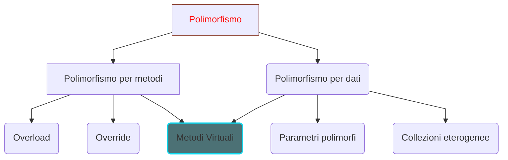

# `Programmazione 29/11/22`

<!--
# <p style="color:OrangeRed">title_big</p>
## <p style="color:SpringGreen">(new)title</p> --->

# <text style=color:red>Polimorfismo
### <text style=color:gray>Outline
+ Polimorfismo per metodi
  + Overload
  + Varargs
  + Override
+ Polimorfismo per dati
  + Parametri polimorfi
  + Collezioni eterogenee
  + Casting
  + Invocazione virtuale di metodi
+ Polimorfismo e interfacce

## Introduzione

Il polimorfismo è un paradigma fondamentale della Object Oriented Programming, dal greco "molte forme", consiste nel riferirsi
con un unico termine a "entità" diverse. Un azione polimorfica può avere diverse implementazioni e dipendere dal contesto.

_Esempio_

Telefonare con fisso o cellulare
__<text style=color:green>Stessa azione ma implementazioni molto diverse__

### Polimorfismo in Java


## Polimorfismo per metodi
Con polimorfismo per metodi si intende l'uso dello stesso nome per metodi differenti, in Java si realizza in due forme:
+ Overload dei metodi
+ Override di metodi nelle sottoclassi

### Overload di metodi
La coppia _identificatore_ e _lista parametri_ é detta __signature__ del metodo, il metodo è identificato dalla signature non solo dal nome.
Dunque più metodi della stessa classe possono quindi avere lo stesso nome, purché abbiano una signature diversa.

__Quando usare l'overload?__
Per metodi che hanno concettualmente la stessa funzionalità, come i costruttori, oppure quando si migliora la leggibilità del codice.

_Esempio_
```java
public class Aritmetica{
    public int somma(int a, int b){
        return a + b;
    }

    public float somma(int a, float b){
        return a + b;
    }

    public float somma(float a, int b){
        return a + b;
    }

    public int somma(int a, int b, int c){
        return a + b + c;
    }
    
    public double somma(int a, double b, int c){
        return a + b + c;
    }
}
```
__Che cosa avremmo fatto in un linguaggio che non supporta overload?__

### Overload
+ <font color =red>Criteri di distinzione nella lista parametri<font color = white>
  + __Tipale__
    + somma_int_int ≠ somma_int_float
  + __Numerico__
    + somma_int_int ≠ somma_int_int_int
  + __Posizionale__
    + somma_int_float ≠ somma_float_int

Il tipo di ritorno inoltre non fa parte della firma del metodo e non può essere usato per distinguere versioni diverse dei metodi

_Esempi di overload_
  + Il metodo println() della libreria (10 versioni)
  + I costruttori delle classi della libreria e delle nostre classi

_Esempio_

```java
public class Cliente{
    private String nome;
    private String indirizzo;
    private String numeroDiTelefono;

    public Cliente(){
        // costruttore inserito esplicitamente
    }

    public Cliente(String nome){
        this.nome = nome;
    }

    public Cliente(String nome, String indirizzo){
        this(nome);
        this.indirizzo = indirizzo;
    }

    public Cliente(String nome, String indirizzo, String numTelefono){
        this(nome, indirizzo);
        this.numeroDiTelefono = numTelefono;
    }
    // . . . 
}
```

## Variable arguments (<text style=color:turquoise>varargs</text>)
In molti linguaggi di programmazione, Java compreso, c'è la possibilità di passare a un metodo o a una funzione
un numero variabile di _argomenti_.
In questo modo, si evita di dover implementare molti metodi in overload _numerico_.
Per implementare un metodo con _varargs_, si usa il simbolo `...` (ellissi).

_Esempio_
```java
public int somma(int... addendi)
// il metodo somma accetta un numero variabile di parametri interi, anche zero parametri.
```

_Esempio_
```java
public class Aritmetica{
    public double somma(double... doubles){
        double risultato = 0.0D;
        for(double tmp : doubles){
            risultato += tmp;
        }
        return risultato;
    }
}
```
```java
// . . .
public static void main(String args[]){
    Aritmetica ogg = new Aritmetica();
    System.out.println(ogg.somma(1, 2, 3));
    System.out.pritnln(ogg.somma());
    System.out.println(ogg.somma(1, 2));
    System.out.println(ogg.somma(1, 2, 3, 5, 6, 8, 4));
}
```
Notiamo che i _varargs_ sono usati nel metodo come se fossero un array. Allora perché non usare un array invece dei varargs?
```java
public double somma(double[] doubles){
    double risultato = 0.0D;
    for(double tmp : doubles){
        risultato += tmp;
    }
    return risultato;
}
```
Ma in questo modo si rende l'invocazione del metodo più complessa, poiché dobbiamo creare l'array da passare invece di passare
semplicemente i valori.
```java
// . . .
double[] doubles = {1.2D, 2, 3.14, 100.0};
System.out.println(ogg.somma(doubles));
```
### Confronto tra _varargs_ e _overload_
+   Overload
    +   Si definiscono esattamente le sequenze di parametri richiesti (cioè una per ogni implementazione)
+   Varargs
    +   Il numero di valori da passare è indefinito ma devono essere tutti dello stesso tipo
    +   E' possibile un solo parametro _varargs_ per ogni metodo, quindi non esistono _varargs_ misti
    +   E' possibile avere altri parametri oltre il _varargs_ ma il _varargs_ deve essere __l'ultimo__ della lista parametri

_Esempio_
```java
public class ClienteVarargs{
    private String nome;
    private String indirizzo;
    private String numeroDiTelefono;

    public ClienteVarargs(String... par){
        if(par != null){
            if(par[0] != null){
                this.nome = par[0];
            }
            if(par[1] != null){
                this.indirizzo = par[1];
            }
            if(par[2] != null){
                this.numeroDiTelefono = par[2];
            }
        }
    }
    // . . .
}
```
## Override di metodi
Non ha senso parlare di override di metodi senza il meccanismo dell'ereditarietà. Possiamo riscrivere un metodo di una sottoclasse, la sottoclasse è sempre più specializzata della superclasse, ma potrebbe avere necessità di ridefinire uno dei metodi ereditati.

```java
public class Punto{
    private int x, y;
    public void setX(int x){
        this.x = x;
    }
    public int getX(){
        return x;
    }
    public void setY(int y){
        this.y = y;
    }
    public double distanzaDallOrigine(){
        int tmp = (x*x) + (y*y);
        return Math.sqrt(tmp);
    }
}
```
```java
public class Punto3D extends Punto{
    private int z;
    public void setZ(int z){
        this.z = z;
    }
    public int getZ(){
        return z;
    }
    public double distanzaDallOrigine(){
        int tmp = getX()*getX() + getY()*getY() + (z*z);\
        return Math.sqrt(tmp);
    }
}
```
### Regole dell'override

Il metodo riscritto nella sottoclasse deve avere la stessa firma del metodo della superclasse.
Il tipo di ritorno del metodo della sottoclasse deve coincidere con quello del metodo che si sta riscrivendo ( o di un tipo che estende il tipo di ritorno del metodo della superclasse).

Il metodo ridefinito nella sottoclasse __non deve__ avere __minori privilegi di accesso__ del metodo originale della superclasse. Se un metodo è originariamente dicihiarato `protected` non si può ridefinire `private` (semmai `public`).

_Esempio_
. . .

### Annotazione _Override_
Se nel ridefinire un metodo sbagliamo una maiuscola nel nome, il compilatore lo intenderà come un nuovo metodo e non segnalerà errori.

Nel package java.lang è definita l'annotazione __Override__

Si può sfruttare per consentire il compilatore di controllare che effettivamente quel metodo è un Override, in caso negativo ci avvisa con un errore.

_Esempio_
```java
public class Punto3D extends Punto {
    @Override
    public double distanzaDallOrigine() {
    ...
    }
}
// Compila
```
```java
public class Punto3D extends Punto {
    @Override
    public double distanzadallOrigine() {
    ... 
    }
}
// Errore di compilazione, "dall" invece di "Dall"
```


    

