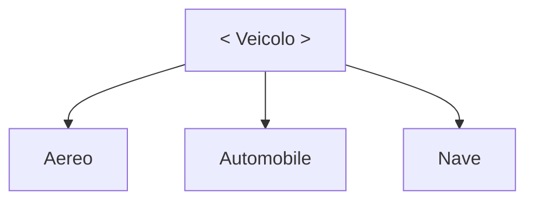
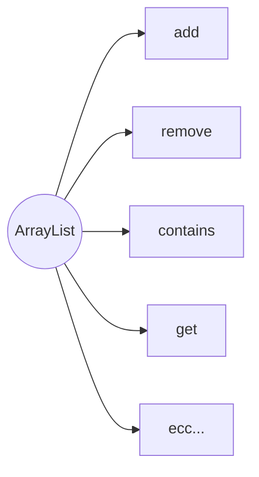

# `Programmazione 30/11/22`

<!--
# <p style="color:OrangeRed">title_big</p>
## <p style="color:SpringGreen">(new)title</p> --->

### Regole dell'override

Il metodo riscritto nella sottoclasse deve avere la stessa firma del metodo della superclasse.
Il tipo di ritorno del metodo della sottoclasse deve coincidere con quello del metodo che si sta riscrivendo ( o di un tipo che estende il tipo di ritorno del metodo della superclasse).

Il metodo ridefinito nella sottoclasse __non deve__ avere __minori privilegi di accesso__ del metodo originale della superclasse. Se un metodo è originariamente dicihiarato `protected` non si può ridefinire `private` (semmai `public`).

_Esempio_
. . .

### Annotazione _Override_
Se nel ridefinire un metodo sbagliamo una maiuscola nel nome, il compilatore lo intenderà come un nuovo metodo e non segnalerà errori.

Nel package java.lang è definita l'annotazione __Override__

Si può sfruttare per consentire il compilatore di controllare che effettivamente quel metodo è un Override, in caso negativo ci avvisa con un errore.

_Esempio_
```java
public class Punto3D extends Punto {
    @Override
    public double distanzaDallOrigine() {
    ...
    }
}
// Compila
```
```java
public class Punto3D extends Punto {
    @Override
    public double distanzadallOrigine() {
    ... 
    }
}
// Errore di compilazione, "dall" invece di "Dall"
```

## Polimorfismo per dati
C'è la possibilità di assegnare a un reference di una superclasse una istanza di una sua sottoclasse:
```java
Punto ogg = new Punto3D();
```
+ Il reference _ogg_ penserà di puntare a una istanza di Punto e quindi potrà accedere alla sua interfaccia pubblica.
+ Anche se _ogg_ punta a un oggetto Punto3D non potrà accedere ad eventuali estensioni della classe (per esempio il metodo __getZ( )__ ).

## Parametri polimorfi
Un parametro reference di un metodo che può puntare a oggetti di altre classi è detto __parametrico polimorfo__.

_Esempio_
+   Il parametro di System.out.println è __Object__ e quindi possiamo passare qualsiasi oggetto di _qualsiasi classe_
    +   println a sua volta chiamerà toString() dell'oggetto.

### Collezioni eterogenee
Posso avere un array di Object che contiene oggetti di qualsiasi tipo:
```java
Object arr[] = new Object[3];
arr[0] = new Punto();
arr[1] = "Hello World!";
arr[2] = new Date();
```
Non si potranno però usare i metodi __specifici__ delle classi.

_Esempio_
```java
public class Dipendente{ 
    public String nome;
    public int stipendio;
    public int matricola; 
    public String dataDiNascita;
    public String dataDiAssunzione;
}

public class Programmatore extends Dipendente{
    public String linguaggiConosciuti;
    public int anniDiEsperienza;
}

public class Dirigente extends Dipendente{ 
    public String orarioDiLavoro;
}

public class AgenteDiVendita extends Dipendente{ 
    public String [] portafoglioClienti;
    public int provvigioni; 
    // . . .
} 
```

### Operatore `instanceof`
Mi serve un metodo che stabilisca le paghe dei dipendenti di vario tipo che memorizzo in un array eterogeneo:
```java
Dipendente [] arr = new Dipendente [180];
arr[0] = new Dirigente();
arr[1] = new Programmatore();
arr[2] = new AgenteDiVendita();
. . .
```
In gnereale un reference può puntare a tipo diversi di oggetti, e posso usare l'operatore _instanceof_ che verifica se un reference punta a un oggetto di una classe.

 f f f f f f 

_Esempio_
```java
public void pagaDipendente(Dipendente dip){
    if (dip instanceof Programmatore) {
        dip.stipendio = 1200;
    } else if (dip instanceof Dirigente) {
        dip.stipendio = 3000;
    } else if (dip instanceof AgenteDiVendita) {
        dip.stipendio = 1000;
    } 
    . . . 
}
```
```java
for (Dipendente dipendente : arr){ 
    pagaDipendente(dipendente);
    . . . 
}
```

## Casting di oggetti

Con un reference di classe base posso riferire oggetti di classi derivate ma non posso accedere alle funzionalità specifiche. Nell’esempio precedente potremmo voler accedere ad anni di esperienza di un programmatore di cui abbiamo solo un reference a dipendente generico.

+   Possiamo usare il __casting esplicito__
```java
if(dip instanceof Programmatore){
    Programmatore pro = (Programmatore) dip;
    if(pro.anniDiEsperienza > 2){
        // . . .
    }
    // . . .
}
```

Se invece avessi provato ad assegnare a _pro_ il reference _dip_ il compilatore avrebbe segnalato un errore
+   Operazione intrinsecamente non sicura
+   Perché?

A tempo di esecuzione, con _instanceof_, possiamo essere certi di fare un __casting sensato e sicuro__. La necessità di casting è spesso (non sempre) indice di cattiva progettazione, ed è da usare solo in alcuni casi particolari, poiché Java ha __strumenti__ che rendono il casting quasi sempre __non necessario__.

## Invocazione virtuale dei metodi
Suppongo di avere un metodo definito in una superclasse, ridefinito nella sottoclasse e invocato per un oggetto della sottoclasse tramite un reference a superclasse.

+   Ad esempio il metodo _toString()_ della classe __Object__ è invocato virtualmente dal metodo _println_

```java
Object obj = new Date();
System.out.println(obj);
```

E viene visualizzata la stringa prodotta dalla toString() definita in Date e __non__ quella generica di Object.

_Esempio_



```java
public abstract class Veicolo{ 
    public abstract void accelera();
    public abstract void decelera();
}
```
```java
public class Aereo extends Veicolo { public void decolla() {
} //. . .
public void atterra() { } //. . .
@Override
public void accelera() { } //. . .
@Override
public void decelera() { } //. . .
} //. . .
```
```java
automobile
```
```java
nave
```
_Esempio overload_
```java
public class Viaggiatore {
public void viaggia(Automobile a) {
a.accelera(); } //. . .
public void viaggia(Aereo a) { a.accelera();
//. . .
}public void viaggia(Nave n) { n.accelera();
//. . .
}/ / . . . }
```

```java
...
Viaggiatore claudio = new Viaggiatore(); 
Aereo piper = new Aereo();
Automobile fiat500 = new Automobile(); 
Nave msc = new Nave();
// . . .
claudio.viaggia(piper); 
claudio.viaggia(fiat500); 
claudio.viaggia(msc);
// . . . 
```
_Esempio <text style=color:turquoise>invocazione virtuale</text>_
```java
public class Viaggiatore {
  public void viaggia(Veicolo v) {
    v.accelera();
    // . . .
    }
    // . . .
}
```

## Polimorfismo e interfacce

Possiamo usare un reference di interfaccia per riferirci a oggetti che la implementano. Le interfacce sono usate per astrarre __comportamenti__ da implementare in classi concrete. Ma ogni classe che deve astrarre il comportamento _deve_ implementare l'interfaccia.

Possiamo creare metodi con parametri polimorfi che sfruttano l'interfaccia e quindi passare a questi metodi reference di oggetti che implementano l'interfaccia.

_Esempio_

```java
Scalable s = new Quadrato();
Scalable s = new Cerchio();
s.setRaggio(); // errore, vede solo i metodi dell'interfaccia scalable
s.scale(1.5); // OK
```
---

_Esempio_
```java
public interface Volante{
    void atterra();
    void decolla();
}
```
```java
public class Aereo extends Veicolo implements Volante{
    @Override
    public void atterra(){
        // override del metodo di Volante
    }

    @Override
    public void decolla(){
        // override del metodo di Volante
    }

    @Override
    public void accelera(){
        // override del metodo di Veicolo
    }

    @Override
    public void decelera(){
        // override del metodo di Veicolo
    }
}
```
_Esempio_
```java
public class TorreDiControllo {
  public void autorizzaAtterraggio(Volante v) {
    v.atterra();
  }
  public void autorizzaDecollo(Volante v) {
    v.decolla();
} }
```
 Perché non usiamo Veicolo come parametro?

Vogliamo un qualsiasi oggetto di una qualsiasi classe che abbia determinati comportamenti
Non tutti i veicoli atterranno e decollano!
- - - - - 
_Esempio_


```java
List<String> l = new LinkedList<>();
// List<String> l = new ArrayList<>();
l.add("ciao");
```
+ LinkedList implementa List
+ ArrayList implementa List

`Usare il Reference con il minimo privilegio necessario`

